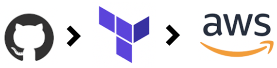

# Terraform-AWS
I created this small project to better my understanding related to connecting my Terraform Cloud workspace to a Version Control System (GitHub). When a commit is made to this repo, a Terraform run executes within the Terraform Cloud to make underlying changes to my AWS account's infrastructure.

